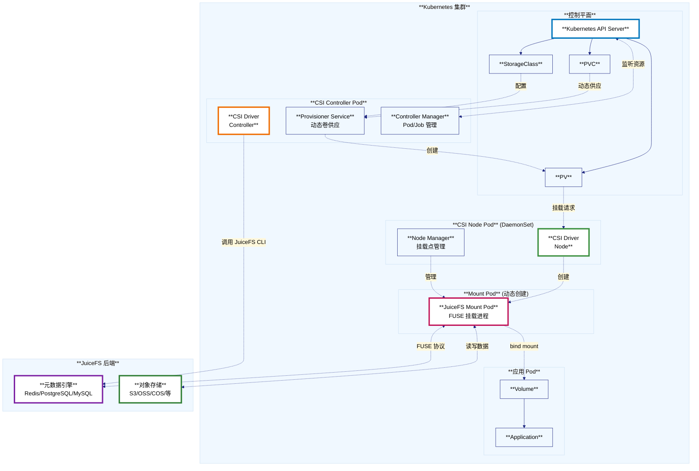
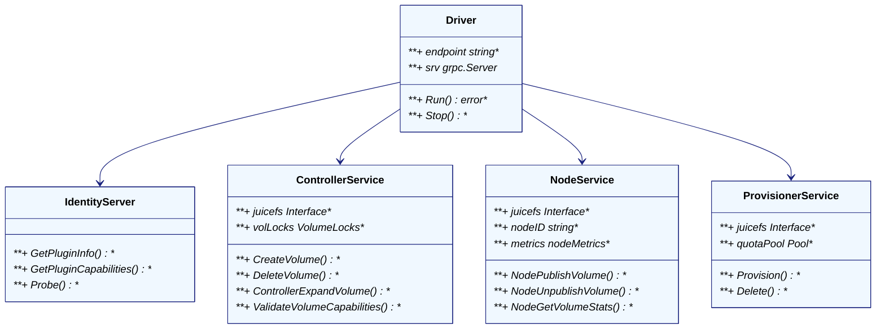
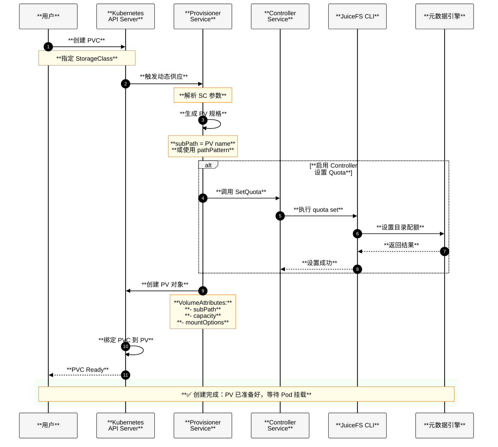
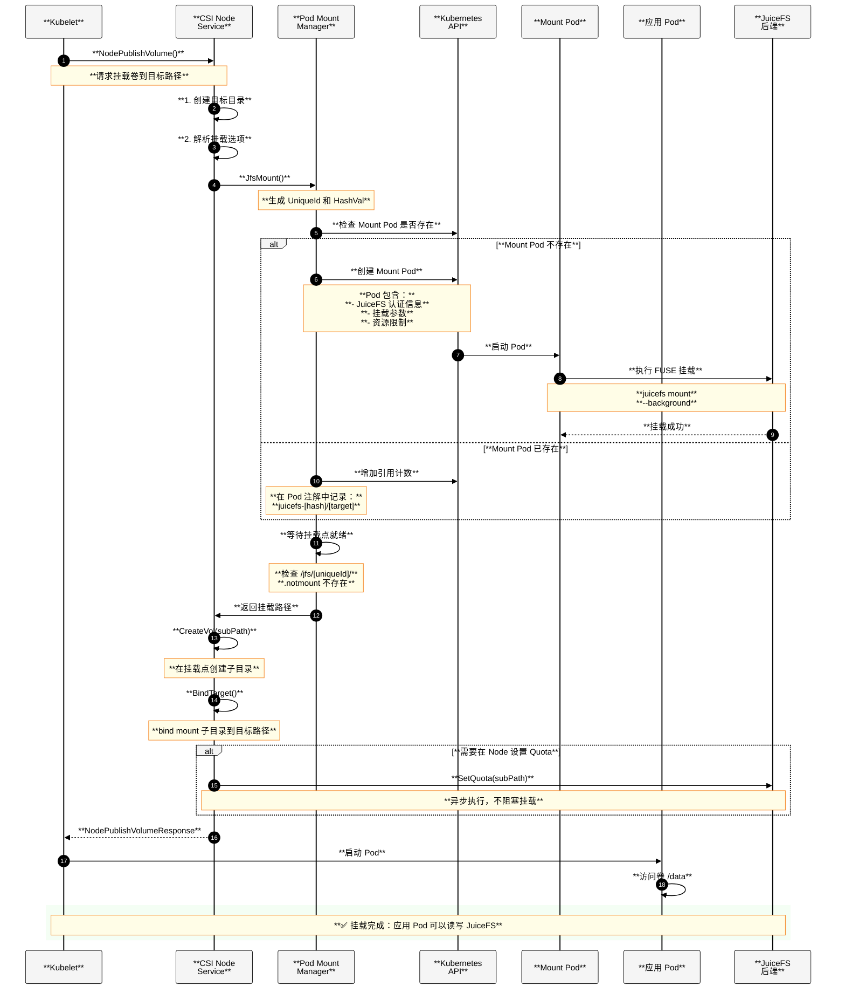
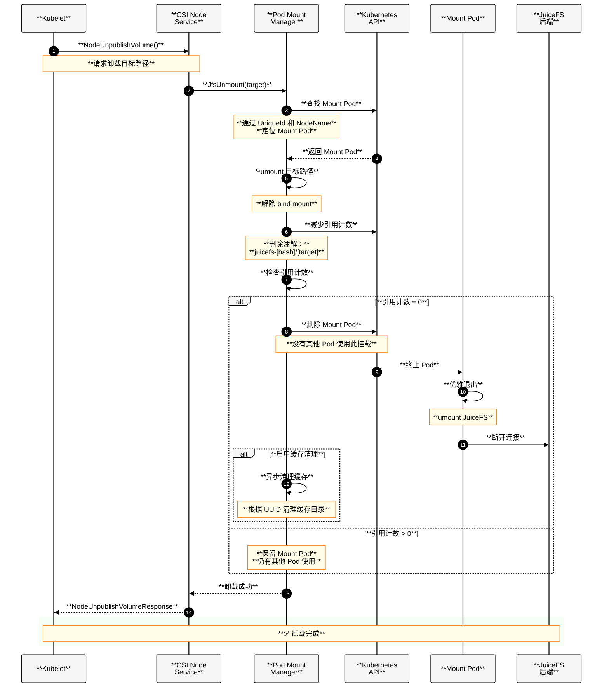
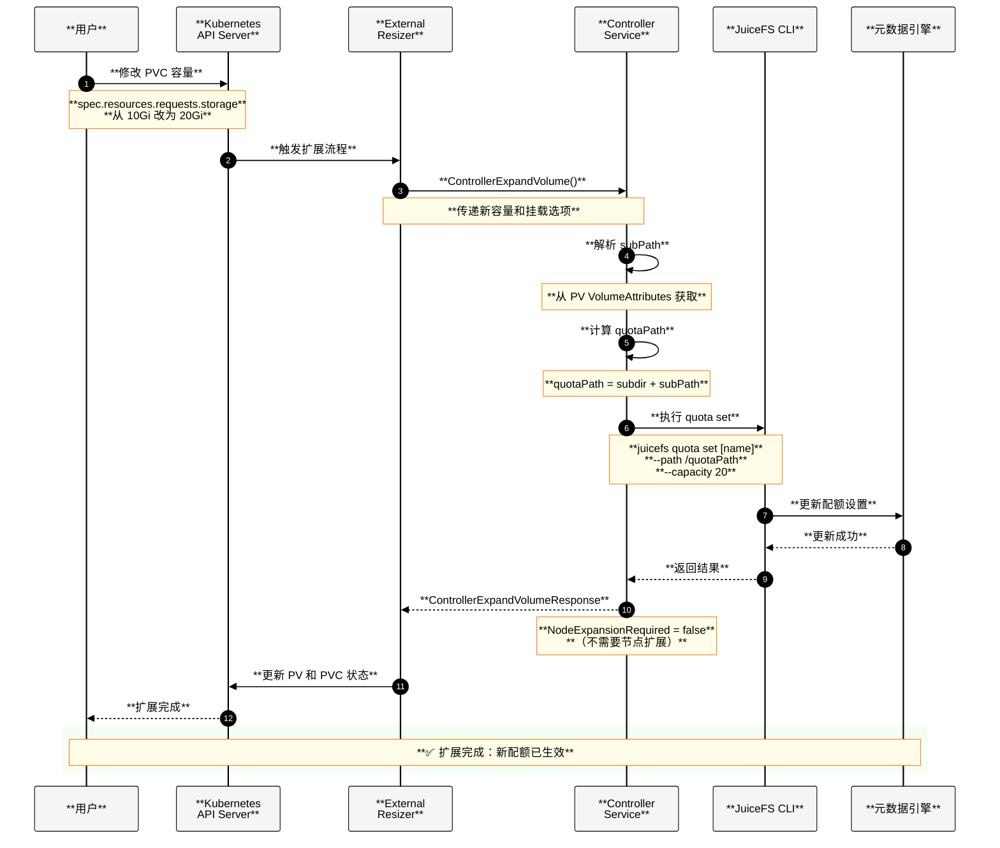
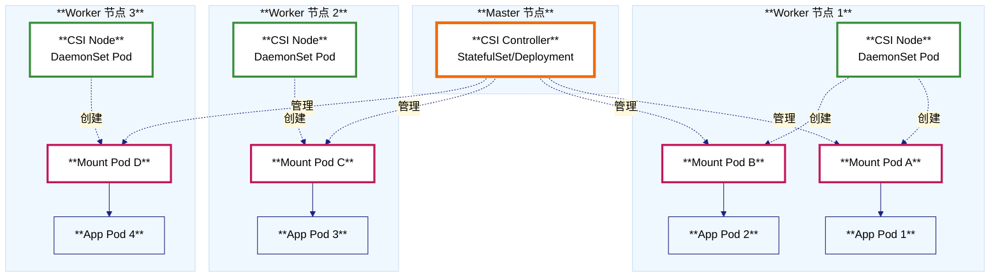

# JuiceFS CSI Driver 架构与接口实现总结

## 1. CSI 接口实现概览

JuiceFS CSI Driver 实现了 Kubernetes Container Storage Interface (CSI) 规范中的三大核心接口：**Identity Service**、**Controller Service** 和 **Node Service**。

### 1.1 已实现的 CSI 接口

```mermaid
%%{init: {'theme':'base', 'themeVariables': { 'primaryColor':'#f0f8ff','primaryTextColor':'#000','primaryBorderColor':'#1a237e','lineColor':'#1a237e','secondaryColor':'#fff8dc','tertiaryColor':'#f0f8ff','fontFamily':'Arial, sans-serif','fontSize':'16px','fontWeight':'bold'}}}%%
graph TB
    subgraph "**CSI Driver**"
        A[**Identity Service**]
        B[**Controller Service**]
        C[**Node Service**]
    end
    
    subgraph "**Identity 接口**"
        A1[**GetPluginInfo**<br/>获取插件信息]
        A2[**GetPluginCapabilities**<br/>获取插件能力]
        A3[**Probe**<br/>健康检查]
    end
    
    subgraph "**Controller 接口**"
        B1[**CreateVolume** ✓<br/>创建卷]
        B2[**DeleteVolume** ✓<br/>删除卷]
        B3[**ControllerExpandVolume** ✓<br/>扩展卷]
        B4[**ValidateVolumeCapabilities** ✓<br/>验证卷能力]
        B5[**ControllerGetCapabilities** ✓<br/>获取控制器能力]
    end
    
    subgraph "**Node 接口**"
        C1[**NodePublishVolume** ✓<br/>挂载卷到节点]
        C2[**NodeUnpublishVolume** ✓<br/>卸载卷]
        C3[**NodeGetVolumeStats** ✓<br/>获取卷统计信息]
        C4[**NodeGetCapabilities** ✓<br/>获取节点能力]
        C5[**NodeGetInfo** ✓<br/>获取节点信息]
    end
    
    A --> A1
    A --> A2
    A --> A3
    
    B --> B1
    B --> B2
    B --> B3
    B --> B4
    B --> B5
    
    C --> C1
    C --> C2
    C --> C3
    C --> C4
    C --> C5
    
    style A fill:#ffffff,stroke:#1976d2,stroke-width:3px
    style B fill:#ffffff,stroke:#f57c00,stroke-width:3px
    style C fill:#ffffff,stroke:#388e3c,stroke-width:3px
```



### 1.2 接口功能详解

#### **Identity Service 接口**

| 接口名称 | 实现状态 | 功能描述 | 源码位置 |
|---------|---------|---------|---------|
| **GetPluginInfo** | ✅ 已实现 | 返回插件名称（`csi.juicefs.com`）和版本信息 | `pkg/driver/identity.go:31` |
| **GetPluginCapabilities** | ✅ 已实现 | 声明支持 `CONTROLLER_SERVICE` 能力 | `pkg/driver/identity.go:43` |
| **Probe** | ✅ 已实现 | 健康检查探针，返回驱动就绪状态 | `pkg/driver/identity.go:62` |

#### **Controller Service 接口**

| 接口名称 | 实现状态 | 功能描述 | 源码位置 |
|---------|---------|---------|---------|
| **CreateVolume** | ✅ 已实现 | 在 JuiceFS 文件系统中创建子目录，设置 Quota | `pkg/driver/controller.go:93` |
| **DeleteVolume** | ✅ 已实现 | 删除动态创建的卷（移动到回收站） | `pkg/driver/controller.go:180` |
| **ControllerExpandVolume** | ✅ 已实现 | 扩展卷容量，调整 Quota 配额 | `pkg/driver/controller.go:325` |
| **ValidateVolumeCapabilities** | ✅ 已实现 | 验证卷访问模式（单节点/多节点读写） | `pkg/driver/controller.go:253` |
| **ControllerGetCapabilities** | ✅ 已实现 | 返回支持的能力（CREATE_DELETE_VOLUME, EXPAND_VOLUME） | `pkg/driver/controller.go:221` |
| **ControllerPublishVolume** | ❌ 未实现 | 返回 Unimplemented | `pkg/driver/controller.go:374` |
| **ControllerUnpublishVolume** | ❌ 未实现 | 返回 Unimplemented | `pkg/driver/controller.go:379` |
| **GetCapacity** | ❌ 未实现 | 返回 Unimplemented | `pkg/driver/controller.go:239` |
| **ListVolumes** | ❌ 未实现 | 返回 Unimplemented | `pkg/driver/controller.go:246` |
| **CreateSnapshot** | ❌ 未实现 | 快照功能未实现，返回 Unimplemented | `pkg/driver/controller.go:310` |
| **DeleteSnapshot** | ❌ 未实现 | 快照功能未实现，返回 Unimplemented | `pkg/driver/controller.go:315` |
| **ListSnapshots** | ❌ 未实现 | 快照功能未实现，返回 Unimplemented | `pkg/driver/controller.go:320` |

#### **Node Service 接口**

| 接口名称 | 实现状态 | 功能描述 | 源码位置 |
|---------|---------|---------|---------|
| **NodePublishVolume** | ✅ 已实现 | 将卷挂载到目标路径，支持 Pod/Process 两种模式 | `pkg/driver/node.go:114` |
| **NodeUnpublishVolume** | ✅ 已实现 | 卸载卷，清理挂载点，管理引用计数 | `pkg/driver/node.go:223` |
| **NodeGetVolumeStats** | ✅ 已实现 | 获取卷的使用统计（容量、inode） | `pkg/driver/node.go:278` |
| **NodeGetCapabilities** | ✅ 已实现 | 返回节点支持的能力（GET_VOLUME_STATS） | `pkg/driver/node.go:246` |
| **NodeGetInfo** | ✅ 已实现 | 返回节点 ID 信息 | `pkg/driver/node.go:264` |
| **NodeStageVolume** | ❌ 未实现 | 返回 Unimplemented（不需要 Stage 阶段） | `pkg/driver/node.go:104` |
| **NodeUnstageVolume** | ❌ 未实现 | 返回 Unimplemented | `pkg/driver/node.go:109` |
| **NodeExpandVolume** | ❌ 未实现 | 返回 Unimplemented（扩展在 Controller 完成） | `pkg/driver/node.go:274` |

---

## 2. 功能架构设计

### 2.1 整体架构图



### 2.2 核心模块说明

#### **1. CSI Driver 核心**



#### **2. JuiceFS Provider 层**

- **功能**：封装 JuiceFS 文件系统操作
- **主要接口**：
  - `JfsMount`: 挂载 JuiceFS 文件系统
  - `JfsUnmount`: 卸载文件系统
  - `JfsCreateVol`: 创建卷子目录
  - `JfsDeleteVol`: 删除卷
  - `SetQuota`: 设置配额
  - `AuthFs`: 认证（企业版）
- **源码位置**：`pkg/juicefs/juicefs.go`

#### **3. Mount 层（两种模式）**

##### **Pod Mount 模式** （默认推荐）

- **特点**：每个挂载点对应一个独立的 Mount Pod
- **优势**：
  - 隔离性好，Pod 间互不影响
  - 易于管理和监控
  - 支持自动升级
- **实现**：`pkg/juicefs/mount/pod_mount.go`

##### **Process Mount 模式**

- **特点**：在 CSI Node 进程内直接启动 JuiceFS 挂载进程
- **优势**：
  - 资源开销小
  - 启动速度快
- **实现**：`pkg/juicefs/mount/process_mount.go`

#### **4. 控制器模块**

- **Pod Controller**：管理 Mount Pod 生命周期
- **Job Controller**：管理清理任务
- **Mount Controller**：管理挂载资源
- **PV Controller**：监听 PV 变更
- **源码位置**：`pkg/controller/`

---

## 3. 时序交互流程

### 3.1 动态卷创建流程



### 3.2 卷挂载流程（Pod Mount 模式）



### 3.3 卷卸载流程



### 3.4 卷扩展流程



---

## 4. 关键特性说明

### 4.1 支持的访问模式

| 访问模式 | 支持状态 | 说明 |
|---------|---------|------|
| **ReadWriteOnce (RWO)** | ✅ 支持 | 单节点读写 |
| **ReadOnlyMany (ROX)** | ✅ 支持 | 多节点只读 |
| **ReadWriteMany (RWX)** | ✅ 支持 | 多节点读写（核心优势） |

### 4.2 两种挂载模式对比

| 特性 | **Pod Mount 模式** | **Process Mount 模式** |
|------|-------------------|---------------------|
| **隔离性** | 高（独立 Pod） | 低（共享 CSI Node 进程） |
| **资源开销** | 较高（每个挂载一个 Pod） | 低（无额外 Pod） |
| **启动速度** | 较慢（需要创建 Pod） | 快（直接启动进程） |
| **可观测性** | 好（独立监控） | 一般 |
| **自动升级** | 支持 | 不支持 |
| **推荐场景** | 生产环境 | 开发测试 |

### 4.3 动态供应特性

- ✅ **自动创建子目录**：基于 PV 名称或 pathPattern
- ✅ **Quota 配额管理**：支持容量限制和扩展
- ✅ **Secret 模板化**：支持动态参数替换（`${.PVC.name}` 等）
- ✅ **Secret Finalizer**：防止 Secret 被过早删除
- ✅ **路径模式（pathPattern）**：灵活的子目录结构

### 4.4 高级功能

1. **挂载点共享**：相同配置的卷可共享同一个 Mount Pod（通过 `STORAGE_CLASS_SHARE_MOUNT`）
2. **缓存管理**：支持自动清理缓存（通过 `cleanCache` 配置）
3. **资源限制**：可为 Mount Pod 设置 CPU/内存限制
4. **优雅升级**：支持 Mount Pod 滚动升级，不中断业务
5. **故障恢复**：自动检测并修复损坏的挂载点

---

## 5. 部署架构



### 5.1 组件部署清单

| 组件 | 部署方式 | 副本数 | 主要职责 |
|------|---------|--------|---------|
| **CSI Controller** | StatefulSet | 1-2（HA） | 动态供应、扩展卷、控制器逻辑 |
| **CSI Node** | DaemonSet | 每节点 1 个 | 挂载/卸载卷到节点 |
| **Mount Pod** | Pod（动态创建） | 按需创建 | FUSE 挂载，数据访问代理 |

---

## 6. 源码结构总览

```
juicefs-csi-driver/
├── cmd/                        # 主程序入口
│   ├── main.go                # CSI Driver 启动入口
│   ├── controller.go          # Controller 启动逻辑
│   └── node.go                # Node 启动逻辑
│
├── pkg/
│   ├── driver/                # CSI 接口实现
│   │   ├── driver.go          # Driver 主结构
│   │   ├── identity.go        # Identity Service
│   │   ├── controller.go      # Controller Service
│   │   ├── node.go            # Node Service
│   │   └── provisioner.go     # Provisioner Service
│   │
│   ├── juicefs/               # JuiceFS 封装层
│   │   ├── juicefs.go         # JuiceFS Provider 接口
│   │   └── mount/             # 挂载实现
│   │       ├── pod_mount.go   # Pod Mount 模式
│   │       ├── process_mount.go # Process Mount 模式
│   │       └── builder/       # Mount Pod 构建器
│   │
│   ├── controller/            # Kubernetes 控制器
│   │   ├── pod_controller.go  # Mount Pod 控制器
│   │   ├── pv_controller.go   # PV 控制器
│   │   └── mount_controller.go # Mount 资源控制器
│   │
│   ├── k8sclient/             # Kubernetes 客户端
│   │   └── client.go          # K8s API 封装
│   │
│   └── config/                # 配置管理
│       ├── config.go          # 全局配置
│       └── setting.go         # JuiceFS 设置
│
└── deploy/                    # 部署清单
    └── kubernetes/
        ├── base/              # Kustomize Base
        └── csi-v1/            # CSI 部署配置
```

---

## 7. 总结

### 7.1 核心优势

1. **✅ 完整的 CSI 实现**：实现了所有必需的 CSI 接口，支持动态供应、挂载、扩展等完整生命周期
2. **✅ 真正的 RWX 支持**：原生支持多节点并发读写，适合 AI/大数据场景
3. **✅ 灵活的挂载模式**：支持 Pod Mount 和 Process Mount 两种模式，适应不同场景
4. **✅ 强大的动态供应**：支持 pathPattern、Quota、Secret 模板化等高级特性
5. **✅ 企业级特性**：支持优雅升级、故障恢复、缓存管理等

### 7.2 适用场景

- **AI/机器学习**：训练数据共享、模型存储、Checkpoint 共享
- **大数据分析**：Spark/Flink/Presto 等共享存储
- **内容管理**：多个 Pod 共同读写的内容库
- **开发测试**：代码共享、构建产物共享

### 7.3 技术亮点

1. **引用计数管理**：精确管理 Mount Pod 生命周期，避免资源浪费
2. **挂载点共享**：相同配置的卷共享 Mount Pod，降低资源开销
3. **异步 Quota 设置**：不阻塞挂载流程，提升用户体验
4. **损坏挂载点检测**：自动修复损坏的挂载点
5. **Webhook 支持**：支持 Sidecar 模式注入

### 7.4 功能限制说明

#### **未实现快照功能**

当前 JuiceFS CSI Driver **未实现 CSI 快照功能**，包括：
- ❌ `CreateSnapshot`：创建卷快照
- ❌ `DeleteSnapshot`：删除卷快照  
- ❌ `ListSnapshots`：列出快照列表

**原因分析**：
1. **JuiceFS 自身的快照机制**：JuiceFS 在文件系统层面已经提供了快照功能（通过 `juicefs snapshot` 命令），不依赖 CSI 快照
2. **设计理念**：JuiceFS 是共享文件系统，CSI 快照更适合块存储场景
3. **替代方案**：用户可以直接使用 JuiceFS 原生的快照功能，或通过备份工具（如 Velero）实现数据保护

**如果需要快照功能，推荐方案**：
- 使用 JuiceFS CLI 直接创建快照：`juicefs snapshot create <name>`
- 使用 Kubernetes 备份工具（Velero + Restic）
- 在应用层实现数据备份逻辑

---

**文档生成时间**：2025-10-21  
**分析的源码版本**：基于 vdocs-master 分支  
**CSI 规范版本**：CSI v1.x

